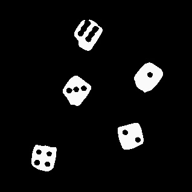
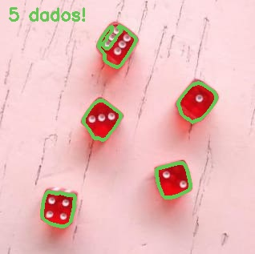

# analise-image-
Visão computacional 

### Desenvolvimento:

#### Primeira imagem formada -> Cinza:

 

##### Segunda imagem formada -> Suave:

#### Terceira imagem formada -> Binaria: 

#### Quarta imagem formada -> Borda:

#### Resultado -> Final:

### Questão Dois:

